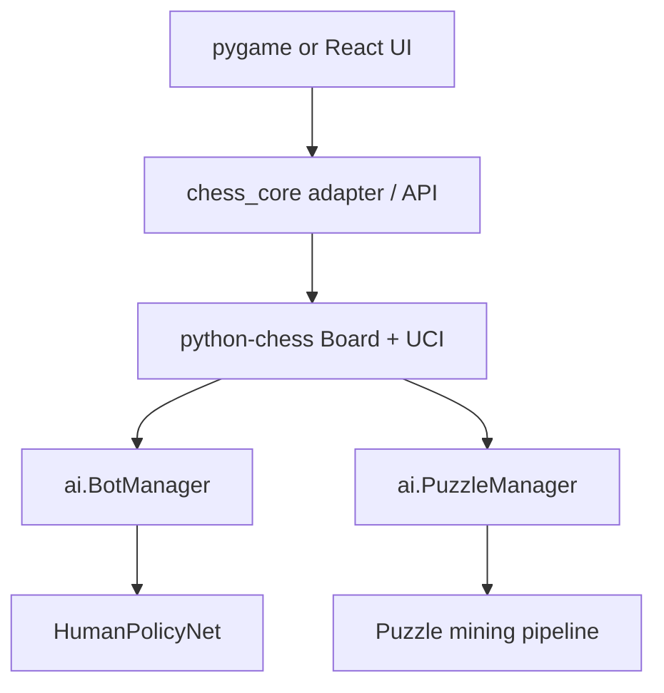

# CHESS V2 ML Architecture

CHESS V2 should grow into an experimental machine-learning chess platform, not a normal chess clone. The current app can keep its React UI and local pygame legacy file, while the ML system uses standard chess representations: `python-chess.Board`, FEN, PGN, and UCI.

## Current Project Diagnosis

- The old pygame game uses `GameState.board`, an 8x8 list where pieces are strings like `wP`, `bK`, and empty squares are `"--"`.
- Old moves are custom `Move` objects with row/column start and end, captured piece, en passant flag, castle flag, and promotion field.
- Old legal moves are generated inside `GameState.get_valid_moves()` by making pseudo-legal moves, filtering own-king checks, and handling castling/en passant/promotion.
- Old undo is stateful: `move_log`, castle-rights log, and en-passant log are restored.
- The web app already uses `chess.js`, so the frontend board is represented by `Chess().board()` and moves are verbose chess.js move objects.
- The current web app already has FEN support indirectly through chess.js. The old pygame game does not expose a clean FEN/PGN API.

## Integration Decision

The ML layer standardizes on `python-chess`. The GUI should not import PyTorch. Integration should flow through adapters:



## Board Encoding

`ml/common/board_encoder.py` creates an `18 x 8 x 8` tensor:

- planes 0-5: white pawn, knight, bishop, rook, queen, king
- planes 6-11: black pawn, knight, bishop, rook, queen, king
- plane 12: side to move
- planes 13-16: castling rights
- plane 17: en passant square

Orientation v1 is absolute: row 0 is rank 1 and column 0 is file a. This avoids silently mixing orientations across training and inference.

## Move Encoding

`ml/common/move_encoder.py` uses a fixed action vocabulary:

- 4096 normal from-square/to-square moves
- 16384 promotion-specific moves
- total: 20480 logits

Every legal move is representable. Illegal moves are removed at inference with a legal move mask, so the neural model can never execute an illegal move.

## First Bot Roadmap

1. Stream real PGNs and build policy shards.
2. Train `HumanPolicyNet` on `(board, rating) -> human move`.
3. Run rating-conditioning reports on the same position for ratings 700, 1000, 1300, 1600, 1900, and 2200.
4. Integrate `HumanPolicyBot` through `ai/bot_manager.py`.
5. Only later add style clusters, value nets, and policy-guided search.

## Commands

Install the ML foundation:

```bash
pip install -r requirements-ml.txt
```

Run encoder tests:

```bash
python -m pytest tests
```

Build a small development policy dataset:

```bash
python -m ml.data.build_policy_shards --input data/raw/sample.pgn --output data/shards/policy/train --max-games 50000
```

Train the first policy model after shards exist:

```bash
python -m ml.bot.train_policy --config ml/config/policy_config.yaml
```

Compare rating-conditioned move distributions:

```bash
python -m ml.bot.rating_conditioning_report --model runs/policy_xxxxx/best.pt --fen "rnbqkbnr/pppppppp/8/8/8/8/PPPPPPPP/RNBQKBNR w KQkq - 0 1"
```

## Why This Order

The first serious AI target is supervised human move prediction, because it can be trained from real games and evaluated before any self-play. Puzzle generation comes after the shared encoders and PGN pipeline are stable. Stockfish should verify puzzle truth, while ML should reduce the expensive candidate search.
